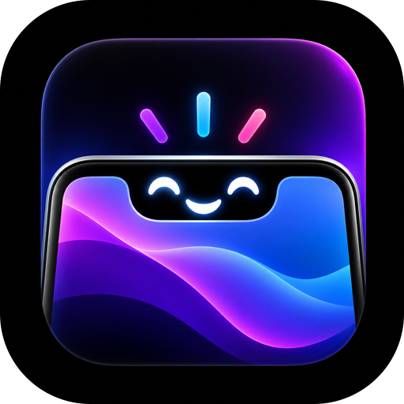

<div align="center">



# EgoNotch

**Your MacBook's notch, with a voice.**

A **Dynamic Island for macOS** — a notch utility whose assistant hears you,
understands you, and runs your Mac.<br>
Entirely on-device: no API keys, no account, no subscription.

<br>


<br>

</div>

<br>

<div align="center">

### Everything in the notch

https://github.com/user-attachments/assets/05807309-a687-4948-9cae-4093792585cf

### Ego, talking back

https://github.com/user-attachments/assets/8adcf016-c71d-47df-803c-b3b923a0dd81

</div>

<br>

---

## Say it, and it happens

```
"Hey Iris, play a song"          →  Playing.
"how far through is this song"   →  It's 1:12 in.
"make it a bit quieter"          →  Volume 40.
"open Zed"                       →  Zed.
"put Chrome on the left"         →  Left half.
"export as PDF"                  →  presses that menu item — in any app
"run git status"                 →  Run git status?   ← waits for your yes
"gaana chalu karo"               →  Playing.
```

Known phrasings act instantly and never touch a model. Anything else goes to
Apple's on-device model. Anything that can bite waits for your yes.

<br>

## In the notch

|  |  |
|---|---|
| **Now Playing** | Artwork, live visualiser, seekable scrubber — Spotify, Music, browsers |
| **Terminal** | A real login shell. Your prompt, your aliases, your history |
| **Recorder** | Photo · video · boomerang · GIF · photo booth · daily selfie |
| **Focus** | Pomodoro, countdowns, stopwatch |
| **Notes · To-Do · Clips · Files** | Notes with checkboxes, a list, clipboard history, a drag-and-drop shelf |
| **Games** | Runner, snake, pong, shooter — built for a strip |
| **Calendar · System · Battery** | Today's events, CPU, memory, disk, charge |

Ducks out of the way in fullscreen. **Invisible to screen sharing**, still
visible to you.

<br>

## Ego

**Wake word.** Iris ,Zoro, Ego, Siri, Notch, Jarvis, Edith, Friday — or add your own.
Each ships with the ways recognisers actually mangle it, and the chosen name is
fed to the recogniser as a vocabulary hint. Without that, a rare name gets
swapped for a commoner word about half the time.

**Only your voice.** macOS ships no speaker-ID API, so this is written from
first principles: MFCC features, dynamic time warping, and a threshold measured
from your own voice rather than guessed. It turns away a different voice; it
won't stop a recording of you.

**The shell, gated.** Every command is read back and waits for your yes.
`sudo`, `rm -rf /`, `mkfs`, `curl … | sh` are refused outright — no confirmation
offered. It won't type while a password field is open.

**Calls.** Off by default. Always confirmed, with the number read back digit by
digit. Messages are drafted, never sent for you.

<br>

## Run it

```sh
git clone git@github.com:suraj7974/EgoNotch.git
cd EgoNotch
make bootstrap && make install
```

Ego wants **Microphone** and **Speech Recognition**. Windows and menu commands
want **Accessibility**. Free phrasing wants **Apple Intelligence**. Nothing is
asked up front — each prompt arrives the first time you use the thing that needs
it, and everything else keeps working without it.

<br>

## It stays here

No network calls. No telemetry. **Audio is never written to disk** — transcripts
live in memory and die when Ego is dismissed. Voice matching keeps measurements,
never recordings. Speech, understanding and synthesis are all Apple's on-device
models.

One thing leaves a trace on purpose: commands Ego runs land in your shell
history, because a command you didn't type is the one you most want to find
later.

<br>

---

<div align="center">


</div>
