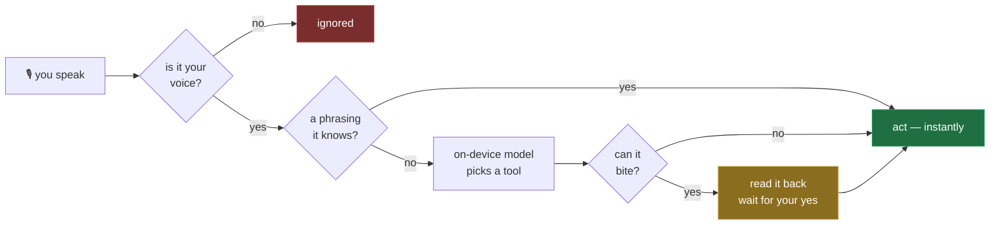
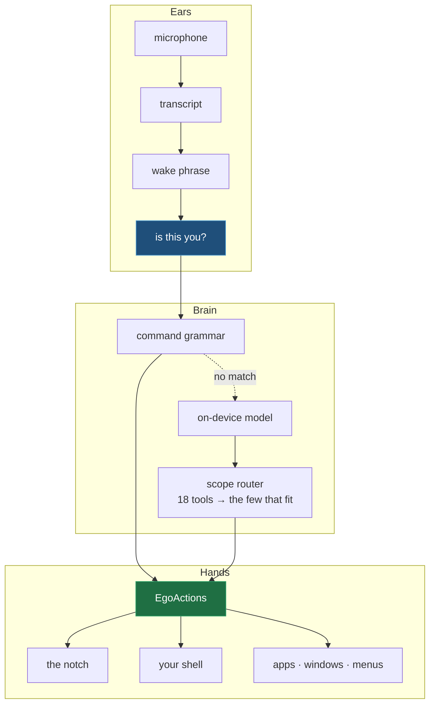

<div align="center">

# EgoNotch

### Your MacBook's notch, with a voice.

A notch utility whose assistant hears you, understands you, and runs your Mac —
**entirely offline**. No API keys. No account. No subscription.

<sub>macOS 26 · Swift 6 · Apple Silicon · MIT</sub>

</div>

---

## See it

<table>
<tr>
<td width="50%" align="center">

**The notch**

<video src="REPLACE_WITH_FEATURES_VIDEO_URL" controls width="100%"></video>

</td>
<td width="50%" align="center">

**Ego, talking back**

<video src="REPLACE_WITH_ASSISTANT_VIDEO_URL" controls width="100%"></video>

</td>
</tr>
</table>

---

## Say it, and it happens

```
"Hey Zoro, pause"                →  Paused.
"how far through is this song"   →  It's 1:12 in.
"make it a bit quieter"          →  Volume 40.
"open Zed"                       →  Zed.
"put Chrome on the left"         →  Left half.
"export as PDF"                  →  presses that menu item — in any app
"run git status"                 →  Run git status?   ← waits for your yes
"gaana chalu karo"               →  Playing.
```

## What happens when you speak

Every sentence takes the shortest road it can. Known phrasings never touch a
model; anything that can bite waits for you.



---

## Inside the notch

**Now Playing** with a live visualiser · **a real login shell**, your prompt and
aliases intact · **Recorder** — photo, video, boomerang, GIF, photo booth ·
**Focus** timers · **Notes** & **To-Do** · **Clipboard** history · a **file
shelf** · **four games** · calendar, battery, CPU.

It ducks out of the way in fullscreen, and it is **invisible to screen sharing**
while still visible to you.

---

## How it's put together



Three ideas hold it up:

**One implementation per verb.** `EgoActions` is the only place anything
happens — grammar, model and tests all call the same function, so the fast path
and the model can never drift apart.

**Isolation is load-bearing.** The audio tap is `nonisolated` on a real-time
thread; an implicitly main-actor callback traps the process on its first buffer.
Accessibility calls run off-main behind deadlines, so a hung app costs six
seconds, not the notch.

**Nobody ships a speaker-ID API.** So voice matching is written from first
principles — MFCC features, dynamic time warping, and a threshold measured from
your own voice rather than guessed.

---

## Run it

```sh
git clone git@github.com:suraj7974/mac-notch.git
cd mac-notch
make bootstrap && make install
```

Ego needs **Microphone** and **Speech Recognition**; windows and menu commands
need **Accessibility**; free phrasing needs **Apple Intelligence**. Nothing is
asked for up front — each prompt arrives the first time you use the thing that
needs it, and everything else keeps working without it.

---

## It stays here

No network calls. No telemetry. **Audio is never written to disk** — transcripts
live in memory and die when Ego is dismissed. Voice matching stores
measurements, never recordings. Speech, understanding and synthesis are all
Apple's on-device models.

The one thing that leaves a trace does so on purpose: commands Ego runs land in
your shell history, because a command you didn't type is the one you most want
to find later.

---

<div align="center">
<sub>Built in four days because a notch app shouldn't cost a subscription.</sub>
</div>
